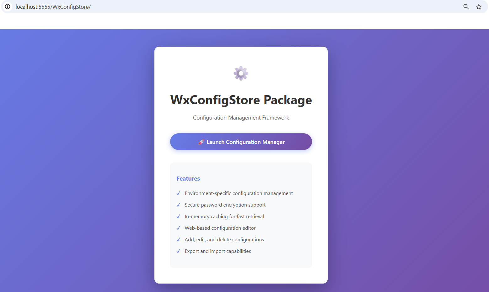
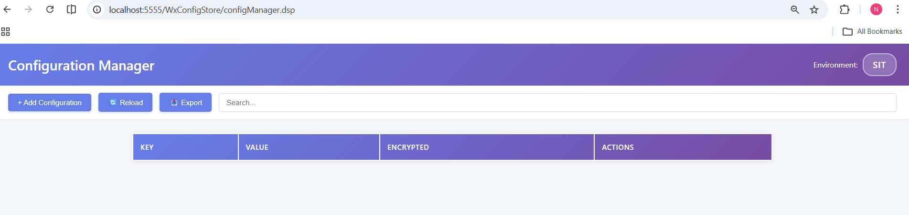
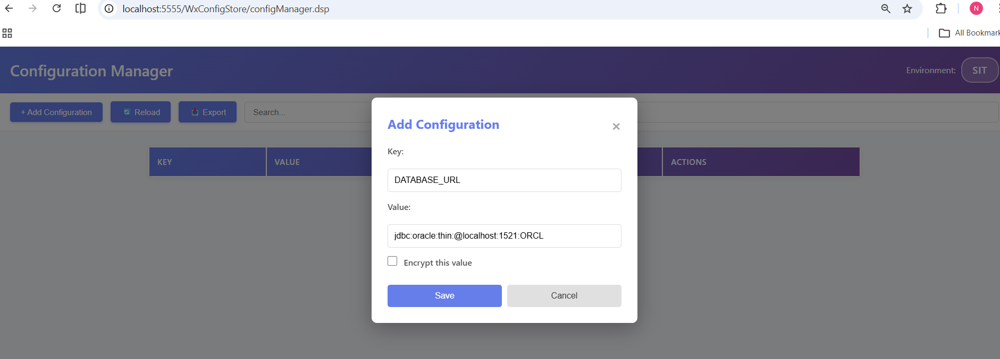
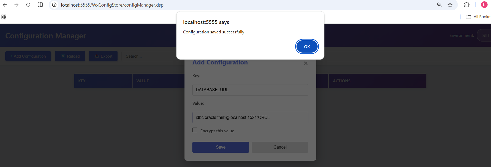
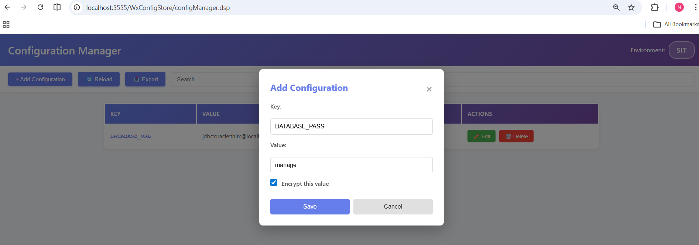
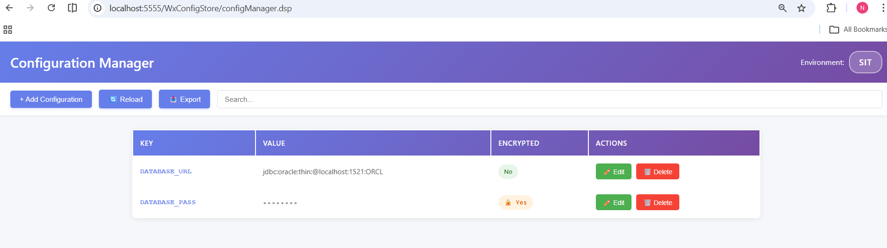

# WxConfigStore Package

A robust configuration management framework for webMethods Integration Server that provides environment-specific configuration storage with encryption support and web-based management interface.

## 🎯 Features

- **Environment-Specific Configuration**: Manage configurations per environment (DEV, TEST, PROD)
- **Secure Password Encryption**: Built-in encryption for sensitive values using Integration Server's password manager
- **In-Memory Caching**: Fast configuration retrieval with automatic caching on startup
- **Distributed Cache Support**: Optional distributed caching for clustered environments
- **Web-Based UI**: Intuitive configuration manager interface for easy management
- **RESTful Services**: Complete CRUD operations via REST APIs
- **XML Import/Export**: Bulk configuration management capabilities
- **Automatic Initialization**: Self-configuring startup with intelligent defaults
- **Dynamic Configuration Files**: Configuration files are automatically created when entries are added

## 📋 Prerequisites

- webMethods Integration Server 10.x or higher
- Java 8 or higher
- Administrator access to Integration Server
- Git (for version control)
- Terracotta Server Array (optional, for distributed caching in clustered environments)

## 🚀 Installation

### Method 1: Manual Installation

1. **Copy Package Files**
   ```bash
   # Copy the entire WxConfigStore directory to your Integration Server packages directory
   xcopy WxConfigStore <IS_HOME>\IntegrationServer\packages\WxConfigStore /E /I /H
   ```

2. **Configure File Access Control**
   
   **Important:** Before activating the package, configure file access permissions in Integration Server.
   
   Edit the file: `<IS_HOME>/IntegrationServer/packages/WmPublic/config/fileAccessControl.cnf`
   
   Add the following entries to allow the package to read and write configuration files:
   
   **Windows:**
   ```properties
   allowedWritePaths=<IS_HOME>\\IntegrationServer\\packages\\WxConfigStore\\config\\*\\config.xml
   allowedReadPaths=<IS_HOME>\\IntegrationServer\\packages\\WxConfigStore\\config\\*\\config.xml
   ```
   
   **Note:** The wildcard `*` allows access to all environment subdirectories (DEV, TEST, PROD, etc.)

3. **Restart Integration Server** (if fileAccessControl.cnf was modified)
   ```bash
   # Windows
   <IS_HOME>\IntegrationServer\bin\shutdown.bat
   <IS_HOME>\IntegrationServer\bin\startup.bat

4. **Activate Package**
   - Navigate to Integration Server Administrator: `http://<server>:<port>`
   - Go to **Packages** → **Management** → **Activate/Inactivate Packages**
   - Locate **WxConfigStore** in the inactive packages list
   - Click **Activate** to enable the package
   - The package will automatically initialize with default settings

### Method 2: Using Deployer

1. Create a deployment package including WxConfigStore
2. Deploy to target Integration Server
3. **Package is automatically activated during deployment** - no manual activation required
4. Verify package is enabled and initialized

## ⚙️ Configuration

### 1. Automatic Initialization

The service `WxConfigStore.startup:initialize` is executed automatically during package initialization. It performs the following setup:

**Default Behavior:**
1. **Environment Variable Setup**
   - Checks if the `Environment` variable exists in the WxConfigStore package's global variables
   - If not found, automatically creates it with the default value `DEV`
   - This ensures the package works out-of-the-box without manual configuration

2. **Cache Manager Creation**
   - Creates the cache manager `WxConfigStore` if it doesn't exist
   - Creates the cache `Config` if it doesn't exist
   - Configurations are loaded into memory for fast retrieval

3. **Configuration File Handling**
   - Configuration files under `config/<ENVIRONMENT>/` are **automatically created** when configuration entries are added
   - No need to manually create these files during initial setup
   - Files are generated dynamically as configurations are added through the UI or services

### 2. Environment Configuration

After initial setup, you can configure the environment in two ways:

**Option A: Update Global Variable (Recommended)**
1. Navigate to Integration Server Administrator
2. Go to **Packages** → **Management** → **WxConfigStore**
3. Click on **Global Variables**
4. Locate the `Environment` variable
5. Update its value (e.g., `TEST`, `PROD`)
6. Save changes
7. **No reload or server restart is required** - changes take effect immediately

**Option B: Re-initialize with Custom Environment**
1. Simply invoke the initialize service with the desired environment parameter:
   ```
   http://<server>:<port>/invoke/WxConfigStore.startup/initialize?environment=PROD
   ```
   
   Or for TEST environment:
   ```
   http://<server>:<port>/invoke/WxConfigStore.startup/initialize?environment=TEST
   ```

2. The service will update the global variable and reload configurations automatically

### 3. Distributed Cache Configuration (Clustered Environments)

For clustered Integration Server environments, you can configure the cache as a distributed cache:

**Steps:**
1. **Remove Default Cache**
   - Navigate to **Settings** → **Caching**
   - Remove the cache manager `WxConfigStore`
   - Remove the cache `Config`

2. **Initialize with Terracotta Server Array**
   - Invoke `WxConfigStore.startup:initialize` with the `tsaurl` parameter
   - Example: 
     ```
     http://<server>:<port>/invoke/WxConfigStore.startup/initialize?tsaurl=localhost:9510
     ```
   - This creates the cache as a distributed cache connected to Terracotta

3. **Verify Distributed Cache**
   - Check **Settings** → **Caching** to confirm distributed cache is created
   - Verify all cluster nodes can access the shared cache

**Benefits of Distributed Cache:**
- ✅ Shared configuration across all cluster nodes
- ✅ Automatic synchronization of configuration changes
- ✅ High availability and failover support
- ✅ Consistent configuration state across the cluster

### 4. Configuration File Structure

Configuration files are **automatically created** when you add configuration entries through the web UI or services. However, for reference, here's the XML format:

**Sample config.xml format:**
```xml
<?xml version="1.0" encoding="UTF-8"?>
<configuration>
  <config>
    <name>DATABASE_URL</name>
    <value>jdbc:oracle:thin:@localhost:1521:ORCL</value>
  </config>
  <config>
    <name>API_KEY</name>
    <value>your-api-key-here</value>
  </config>
  <config>
    <name>DB_PASSWORD</name>
    <value>EntrustPbePlus</value>
  </config>
  <config>
    <name>API_ENDPOINT</name>
    <value>https://api.example.com/v1</value>
  </config>
</configuration>
```

**Notes:**
- Files are stored in `config/<ENVIRONMENT>/config.xml`
- For encrypted values, the system automatically adds the `EntrustPbePlus` value
- You don't need to manually create or edit these files - use the web UI or services instead
- Files are automatically generated when the first configuration is added for an environment

## 📖 Usage

### Web Interface

Access the configuration manager at:
```
http://<server>:<port>/WxConfigStore
```

#### Screenshots

**Home Page**



**Configuration Manager - Main View**



**Adding a New Configuration**





**Encryption Support**





**Features:**
- ✅ View all configurations in a table
- ✅ Add new configurations (files created automatically)
- ✅ Edit existing configurations
- ✅ Delete configurations
- ✅ Mark values as encrypted
- ✅ Export configurations to XML
- ✅ Import configurations from XML

### Available Services

#### Core Services (WxConfigStore.pub)

| Service | Description | Input | Output |
|---------|-------------|-------|--------|
| `getConfig` | Retrieve specific configurations | `inputList` (String[]) | `outputList` (String[]) |
| `getConfigValue` | Get a single configuration value | `name` (String) | `value` (String) |
| `getAllConfigs` | Get all configurations | None | Document list with name, value, encrypted |
| `setConfig` | Add or edit a configuration | `name`, `value`, `encrypted`, `action` | `success`, `message` |
| `deleteConfig` | Remove a configuration | `name` (String) | `success`, `message` |
| `exportConfig` | Export configurations to XML | None | XML string |
| `loadConfigValuesXML` | Import/reload configurations from XML | XML string (optional) | `success`, `message` |

**Note:** `loadConfigValuesXML` can be used to reload configurations from the XML file without restarting the server.

#### Utility Services (WxConfigStore.util)

| Service | Description |
|---------|-------------|
| `getCurrentDirectory` | Get current package directory path |
| `manageSecureString` | Encrypt/decrypt secure strings |
| `throwException` | Throw custom exceptions |

#### Startup Services (WxConfigStore.startup)

| Service | Description | Parameters |
|---------|-------------|------------|
| `initialize` | Load configurations and setup cache | `environment` (optional), `tsaurl` (optional for distributed cache) |
| `loadConfigValuesXML` | Import/reload configurations from XML | None |

**Initialize Service Parameters:**
- `environment` (String, optional): Override the default environment value (e.g., "PROD", "TEST")
- `tsaurl` (String, optional): Terracotta Server Array URL for distributed cache (e.g., "localhost:9510")

## 🔒 Security

### Password Encryption

The package supports automatic encryption of sensitive values using Integration Server's built-in password manager.

**How it works:**
1. When adding/editing a configuration, set `encrypted=true`
2. The value is automatically encrypted using the password manager
3. Encrypted values are stored with the value `EntrustPbePlus`
4. Values are automatically decrypted when retrieved

## 🔧 Troubleshooting

### Issue: Configuration Not Loading

**Symptoms:** Configurations not available after server restart

**Solutions:**
1. Check if the `Environment` global variable is set correctly:
   - Navigate to **Packages** → **Management** → **WxConfigStore** → **Global Variables**
   - Verify the `Environment` variable exists and has the correct value

2. Verify config file exists: `config/<ENVIRONMENT>/config.xml`
   - If the file doesn't exist, it will be created when you add the first configuration

3. Check server logs for initialization errors:
   - Look for errors during package load
   - Check for XML parsing errors

4. Manually invoke the service to reload configurations:
   ```
   http://<server>:<port>/invoke/WxConfigStore.startup/loadConfigValuesXML
   ```

5. Verify cache manager and cache exist:
   - Navigate to **Settings** → **Caching**
   - Check for `WxConfigStore` cache manager and `Config` cache

### Issue: Encryption/Decryption Errors

**Symptoms:** Cannot decrypt encrypted values or encryption fails

**Solutions:**
1. Ensure password manager is properly configured
2. Verify encrypted values were created on the same server
3. Check `config/passman.cnf` exists and is readable
4. Don't copy encrypted values between different servers
5. Re-encrypt values if migrating to a new server

### Issue: Changes Not Reflected Immediately

**Symptoms:** Configuration updates not visible in applications

**Solutions:**
1. **To apply updates immediately**, manually invoke the `loadConfigValuesXML` service:
   ```
   http://<server>:<port>/invoke/WxConfigStore.startup/loadConfigValuesXML
   ```

2. Or reload the package: **Packages** → **Management** → **WxConfigStore** → **Reload**

3. Cache is automatically refreshed when `loadConfigValuesXML` is invoked

4. For clustered environments with distributed cache, changes propagate automatically

### Issue: Distributed Cache Not Working

**Symptoms:** Cache not shared across cluster nodes

**Solutions:**
1. Verify Terracotta Server Array is running and accessible
2. Check `tsaurl` parameter is correct when initializing
3. Ensure all cluster nodes can connect to TSA
4. Verify distributed cache is created in **Settings** → **Caching**
5. Check network connectivity between IS nodes and TSA
6. Review Terracotta logs for connection errors

### Issue: Web Interface Not Accessible

**Symptoms:** 404 error when accessing web interface

**Solutions:**
1. Verify package is enabled and activated
2. Check `webappLoad` is set to `yes` in manifest.v3
3. Clear browser cache
4. Check Integration Server logs for errors
5. Verify URL: `http://<server>:<port>/WxConfigStore`

### Issue: Environment Variable Not Created

**Symptoms:** Environment variable missing after package activation

**Solutions:**
1. Check if `initialize` service was executed during startup
2. Verify startup service is configured in manifest.v3
3. Manually invoke `initialize` service:
   ```
   http://<server>:<port>/invoke/WxConfigStore.startup/initialize
   ```
4. Check server logs for startup errors
5. Ensure package has write permissions to global variables

### Issue: Configuration File Not Created

**Symptoms:** config.xml file doesn't exist for environment

**Solutions:**
1. This is normal - files are created automatically when you add the first configuration
2. Add a configuration through the web UI or `setConfig` service
3. The file will be created automatically in `config/<ENVIRONMENT>/config.xml`
4. If you need to manually create the file, use the sample format provided in this README

## 📦 Version History

### Version 1.0 (2026-04-02)
- ✨ Initial release
- ✨ Core configuration management features
- ✨ Automatic initialization with intelligent defaults
- ✨ Dynamic configuration file creation
- ✨ Web-based UI with modern design
- ✨ Encryption support for sensitive values
- ✨ Environment-specific configurations
- ✨ In-memory caching for performance
- ✨ Distributed cache support for clustered environments
- ✨ RESTful API support
- ✨ Import/Export capabilities
- ✨ Hot reload capability with loadConfigValuesXML

## 🤝 Contributing

Contributions are welcome! Please follow these guidelines:

1. Fork the repository
2. Create a feature branch (`git checkout -b feature/AmazingFeature`)
3. Make your changes
4. Test thoroughly on Integration Server
5. Commit your changes (`git commit -m 'Add some AmazingFeature'`)
6. Push to the branch (`git push origin feature/AmazingFeature`)
7. Open a Pull Request

### Development Guidelines

- Follow webMethods best practices
- Document all services with clear descriptions
- Add comments to complex flow logic
- Test on multiple Integration Server versions
- Update README.md with new features
- Maintain backward compatibility

## 👥 Authors

- **Natarajan Ramachandran** - Initial work

## 📞 Support

For issues, questions, or contributions:

- **Issues**: Create an issue in the repository
- **Email**: [natarajan.ramachandran@ibm.com](mailto:natarajan.ramachandran@ibm.com)

## 🙏 Acknowledgments

- webMethods Integration Server team
- IBM community
- All contributors and testers

## 📚 Additional Resources

- [webMethods Integration Server Documentation](https://www.ibm.com/docs/en/webmethods-integration/wm-integration-server)
- Package home page: `http://<server>:<port>/WxConfigStore`

---

**Note**: This package requires a webMethods Integration Server to function. It is not a standalone application.